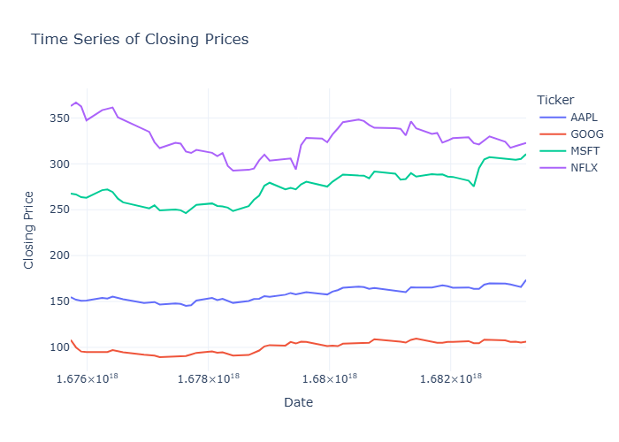
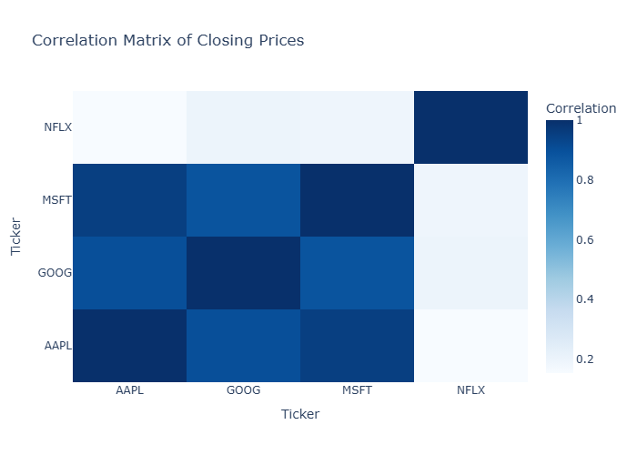
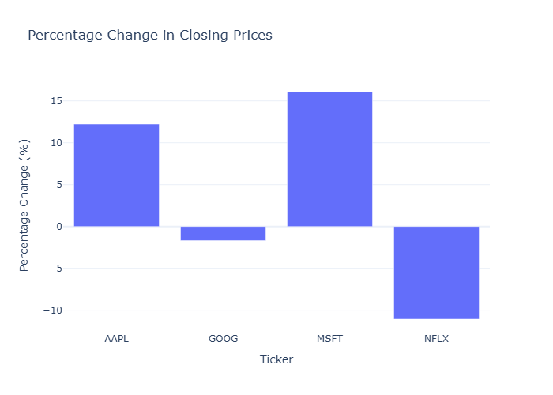
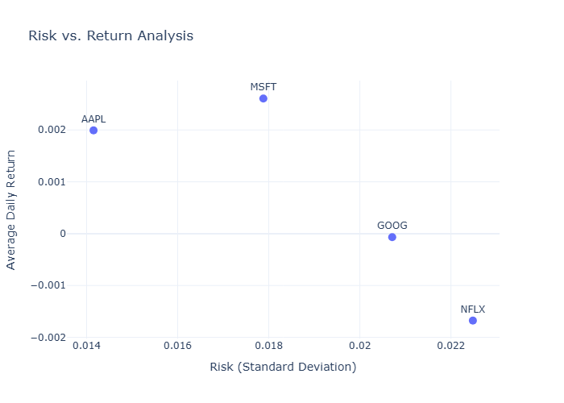

# 📊 Stock Market Analysis Project

A comprehensive quantitative analysis of stock market data using Python.  
This project explores the performance, risk, and relationships of key stocks using statistics, time series analysis, and financial metrics.

---

## 📁 Dataset Overview

The dataset (`stocks.csv`) contains daily trading data for major tech stocks:

- 📈 **Stocks Analyzed**: AAPL, GOOG, MSFT, NFLX  
- 📅 **Fields Included**: Date, Open, High, Low, Close, Adj Close, Volume

---

## 📸 Project Screenshots

<p align="center">
  
  
</p>
<p align="center">
  
  
</p>

---

## 🔍 Analysis Performed

### 1. 🧮 Descriptive Statistics
- Mean, Median, Standard Deviation
- Percentiles, Min/Max, etc.

### 2. 📉 Time Series & Volatility Analysis
- Rolling mean & std deviation
- Visualization of price fluctuations

### 3. 🔗 Correlation & Comparative Analysis
- Correlation matrix across stocks
- Side-by-side trend comparisons

### 4. 📊 Advanced Metrics
- **Sharpe Ratio**: Risk-adjusted return  
- **Beta**: Stock sensitivity to market  
- **CAGR**: Compound Annual Growth Rate

### 5. 📐 Inferential Statistics
- Hypothesis testing
- Confidence intervals and significance levels

---

## 🛠️ Tools & Libraries Used

- Python 🐍
- Pandas
- NumPy
- Matplotlib / Seaborn
- SciPy
- Jupyter Notebook

---

## 🚀 How to Run

1. Clone this repo or download the files:
```bash
git clone https://github.com/Rishitagpt/Stock-Analysis.git
cd Stock-Analysis
```
2. Open the notebook:
```bash
jupyter notebook stocks_analysis_using_pyth.ipynb
```
3. Run the cells and explore the analysis.

---

## 📁 Project Structure

```text
Stock-Analysis-main/
├── stocks_analysis_using_pyth.ipynb
├── stocks.csv
└── README.md
```

